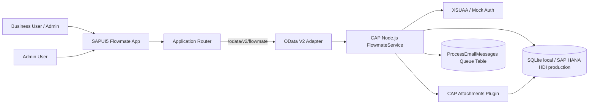
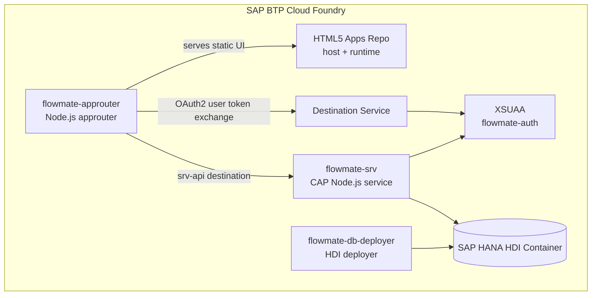
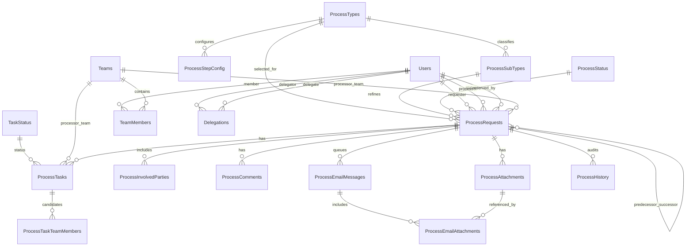
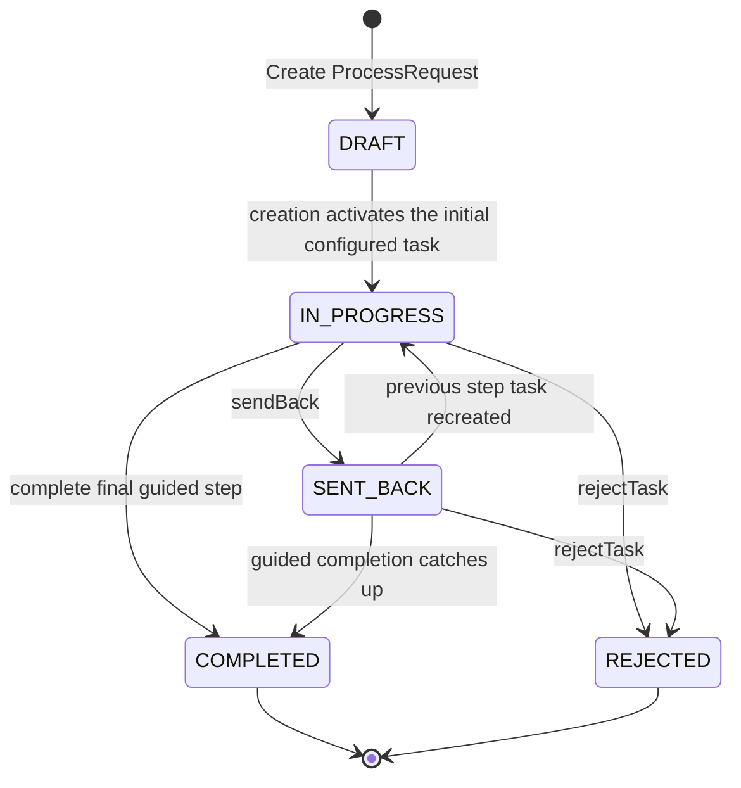
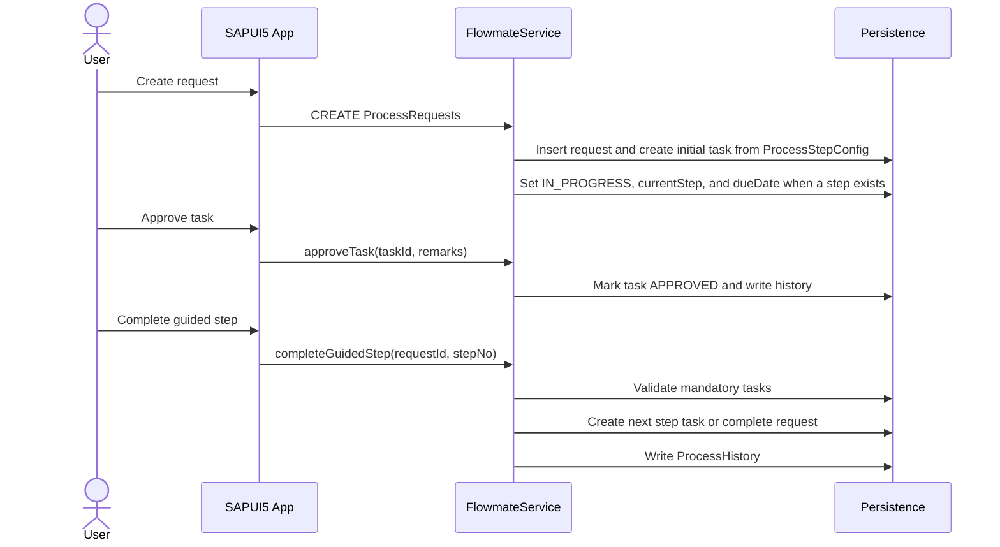
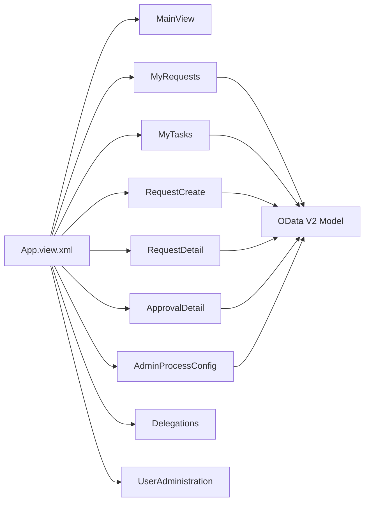
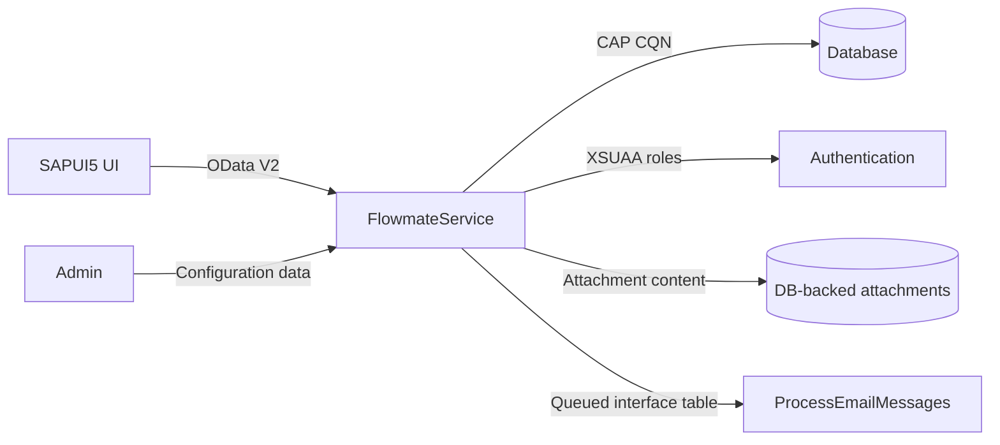

# Flowmate Technical Architecture

## 1. Executive Summary

Flowmate is an SAP CAP-based workflow application for creating, reserving, processing, approving, sending back, rejecting, and completing process requests. The project combines:

- SAP CAP Node.js service runtime.
- CDS domain model and OData service model.
- SAPUI5/Fiori-style frontend.
- OData V2 adapter for UI compatibility.
- CAP attachment handling backed by database storage.
- XSUAA-based authentication and an `Admin` role in production.
- SAP HANA HDI persistence for Cloud Foundry deployment, with SQLite for local development.

The core business capability is configurable guided workflow execution. Administrators configure process types, status code lists, teams, users, and step definitions. End users create process requests, reserve work, act on tasks, send requests back, add comments and attachments, queue email interface records, and view workflow history.

## 2. Repository Structure

```text
flowmate/
  app/
    services.cds
    flowmate/
      annotations.cds
      webapp/                 # SAPUI5 application
  db/
    schema.cds                # CAP domain model
    data/*.csv                # initial code lists, users, and workflow config
    undeploy.json
  router/
    xs-app.json               # approuter routes
    package.json
  scripts/
    seed-process-requests.js  # load-test/process request seeding utility
  srv/
    flowmate.cds              # service projections and actions
    flowmate.js               # service implementation
  mta.yaml                    # Cloud Foundry MTA descriptor
  package.json                # CAP/runtime dependencies and profiles
  xs-security.json            # XSUAA scopes and role templates
```

## 3. Logical Architecture



The SAPUI5 app consumes `/odata/v2/flowmate/`, which is exposed by CAP through `@cap-js-community/odata-v2-adapter`. The service is implemented as `FlowmateService`, an extension of `cds.ApplicationService`.

## 4. Deployment Architecture



The `mta.yaml` defines these deployable modules:

| Module | Type | Responsibility |
| --- | --- | --- |
| `flowmate_app` | `html5` | Builds the SAPUI5 application. |
| `flowmate-app-content` | `com.sap.application.content` | Uploads built UI content to HTML5 apps repo host. |
| `flowmate-approuter` | `nodejs` | Authenticated entry point, static UI serving, OData routing. |
| `flowmate-srv` | `nodejs` | CAP service runtime. |
| `flowmate-db-deployer` | `hdb` | Deploys generated HANA artifacts. |
| `flowmate-destination-content` | `com.sap.application.content` | Creates destinations for service and HTML5 app access. |

Production persistence is SAP HANA via `@cap-js/hana`; local development uses SQLite via `@cap-js/sqlite`.

## 5. CAP Runtime Configuration

`package.json` configures CAP profiles:

| Profile | Auth | DB | Attachments |
| --- | --- | --- | --- |
| development | mocked users | SQLite | DB storage, scanning enabled |
| hybrid | bound services | HANA | DB storage, scanning disabled |
| production | XSUAA | HANA | DB storage, scanning disabled |

Important runtime dependencies:

- `@sap/cds` and `@sap/cds-dk` for CAP runtime and tooling.
- `@cap-js/hana` for HANA persistence.
- `@cap-js/sqlite` for local development.
- `@cap-js/attachments` for managed attachment entities.
- `@sap/xssec` for XSUAA integration.
- `@cap-js-community/odata-v2-adapter` for OData V2 exposure to UI5.

## 6. Domain Model

Flowmate's domain model is defined in `db/schema.cds` under namespace `flowmate.db`.

### 6.1 Domain Overview



### 6.2 Core Aggregates

#### Process Request

`ProcessRequests` is the central aggregate root. It stores:

- Business identity: `referenceNumber`, `title`, `description`, `department`, `priority`.
- Classification: `processType`, `subProcessType`.
- Ownership: `requesterUser`, `processorUser`, `processorTeam`, `reservedByUser`.
- Workflow state: `status`, `currentStep`, `dueDate`, `completedAt`.
- Linked workflow content: tasks, involved parties, comments, attachments, email records, and history.
- Chaining: predecessor and successor relationships for related requests.

#### Process Task

`ProcessTasks` models work to be completed for a request step. It supports:

- Step identity: `stepNo`, `taskName`, `role`.
- Assignment to a single processor or a team.
- Team candidate rows through `ProcessTaskTeamMembers`.
- Mandatory task handling.
- Decision and completion metadata.

#### Configuration

The workflow is driven by configuration entities:

- `ProcessTypes`: top-level request/workflow category.
- `ProcessSubTypes`: process-specific subcategories with owner, activity description, and SAP transaction code.
- `ProcessStepConfig`: ordered step definitions per process type, including role, SLA days, activity description, and optional processor team.
- `ProcessStatus` and `TaskStatus`: status code lists used by request and task state transitions.

#### User, Team, and Delegation

`Users`, `Teams`, and `TeamMembers` provide the internal user directory and team assignment model. Snapshot fields such as display name and email are copied to task and request records to preserve readable workflow history.

`Delegations` supports notification forwarding from one user to another for a date range. Delegations can be self-created by users or created on behalf of another user by an administrator.

#### Attachments and Email Interface

`ProcessAttachments` extends CAP's `Attachments` entity and links files to process requests. Accepted file types include PDF, images, text, Microsoft Word, and Microsoft Excel files, with a configured maximum of 50 MB.

`ProcessEmailMessages` and `ProcessEmailAttachments` form an outbound email interface table model. The application queues email records but does not directly integrate with an SMTP or mail provider in the current implementation.

### 6.3 Reference Data and Business Inputs

The model also contains request form helper entities:

- `RequestType`
- `RequestDropDown`
- `projectCode`
- `materialCode`
- `serviceCode`
- `equipmentCode`
- `serviceEntrySheet`
- `materialReservation`
- `civilRR`
- `powerRR`
- `outlineContract`
- `centralizedPO`
- `inhousePOProcess`
- `DNSProcess`

These entities are projected by the service and seeded through CSV files for UI value helps and business-specific request attributes.

## 7. Service Model

`srv/flowmate.cds` exposes `FlowmateService`, protected with:

```cds
@requires: 'authenticated-user'
service FlowmateService { ... }
```

The service projects domain entities from `flowmate.db`, redirects associations for OData navigation, and defines task/request actions.

### 7.1 Exposed Entity Groups

| Group | Entities |
| --- | --- |
| Configuration | `ProcessTypes`, `ProcessSubTypes`, `ProcessStatus`, `TaskStatus`, `ProcessStepConfig`, `RequestDropDown` |
| Identity | `Users`, `Teams`, `TeamMembers`, `Delegations` |
| Workflow | `ProcessRequests`, `ProcessTasks`, `MyAssignedTasks`, `MyTeamTasks`, `RequestDetailTasks`, `ProcessTaskTeamMembers` |
| Collaboration | `ProcessInvolvedParties`, `ProcessComments`, `ProcessAttachments`, `ProcessEmailMessages`, `ProcessEmailAttachments`, `ProcessHistory` |
| Personalization | `RequestFilterQueries` |
| Request form helpers | `RequestType`, `projectCode`, `materialCode`, `serviceCode`, and related code entities |

`MyAssignedTasks`, `MyTeamTasks`, and `RequestDetailTasks` are projections of `ProcessTasks` optimized for different UI queues and read filters.

### 7.2 Custom Actions and Functions

| Operation | Purpose |
| --- | --- |
| `approveTask` | Approves a task without automatically moving the request step. |
| `rejectTask` | Rejects a task and rejects the parent request. |
| `sendBack` | Sends a task/request back to a previous configured step. |
| `reserveRequest` | Reserves a request for the current user and assigns unassigned tasks. |
| `completeGuidedTask` / `completeGuidedStep` | Completes a configured workflow step and advances to the next step. |
| `analyzeGuidedTaskCompletion` / `analyzeGuidedStepCompletion` | Checks whether completion requires user decision due to already-completed downstream steps. |
| `getGuidedProcessTasks` | Returns task status data for a request's guided process. |
| `updateRequestStatus` / `updateTaskStatus` | Manual status updates with validation. |
| `assignRequestProcessor` / `assignRequestTeam` | Assigns request ownership. |
| `assignTaskProcessor` / `assignTaskTeam` / `assignTeamTaskToMe` | Assigns task ownership or lets a team member claim a team task. |
| `sendRequestEmail` | Queues an email interface record with optional request attachments. |
| `resolve*NotificationRecipient` | Resolves direct or delegated notification recipient addresses. |
| `getCurrentUserDetails` | Returns the matched Flowmate user for the authenticated principal. |
| `get*Count` functions | Returns dashboard/task/reservation counts. |
| `getApplicationCapabilities` | Returns role-driven UI capabilities. |

## 8. Workflow State Model

### 8.1 Request Statuses

Seeded statuses:

- `DRAFT`
- `IN_PROGRESS`
- `SENT_BACK`
- `REJECTED`
- `COMPLETED`

`COMPLETED` and `REJECTED` are locked terminal states. Once a request reaches either state, update/delete operations on the request, tasks, comments, attachments, involved parties, and related objects are rejected.

### 8.2 Task Statuses

Seeded statuses:

- `OPEN`
- `APPROVED`
- `REJECTED`
- `SENT_BACK`
- `COMPLETED`

The implemented task progression mainly uses `OPEN`, `APPROVED`, `REJECTED`, and `SENT_BACK`.

### 8.3 Request Lifecycle



### 8.4 Guided Step Progression



Important progression rules:

- Step configuration is loaded from `ProcessStepConfig` by `processType_code`.
- Closing steps are detected by step names containing `closed`, `complete`, or `completed`.
- Mandatory tasks must be approved before a guided step can complete.
- If downstream tasks already exist, completion can ask the UI to decide between continuing, jumping to an incomplete step, or retriggering the next step.
- SLA due date is calculated from the step's `slaDays`.

## 9. Authorization and Data Visibility

### 9.1 Authentication

All service access requires an authenticated user. Local development uses mocked users defined in `package.json`. Production uses XSUAA.

### 9.2 Roles

`xs-security.json` defines one application role:

| Role | Scope | Purpose |
| --- | --- | --- |
| `Admin` | `$XSAPPNAME.Admin` | Maintain users, teams, process configuration, code lists, and delegated assignments. |

The implementation also accepts lowercase `admin` during role checks.

### 9.3 Read Filtering

The service applies data visibility filters in `srv/flowmate.js`:

- Non-admin users only read active users.
- Request reads show unreserved requests plus requests reserved by the current user.
- Task reads are filtered by processor email, processor user ID, or legacy processor string.
- Team task reads are filtered through `ProcessTaskTeamMembers`.
- Child objects such as comments, attachments, email messages, involved parties, history, and email attachments are filtered through visible parent requests.
- Expanded request tasks are filtered again after read to avoid leaking unrelated task assignments.

### 9.4 Mutation Guards

The service blocks:

- Non-admin maintenance of users, teams, team members, process step configuration, and code lists.
- Deletion of users; users must be deactivated to preserve workflow history.
- Updates/deletes for completed or rejected requests.
- Direct maintenance of `ProcessEmailMessages` and `ProcessEmailAttachments`; email records must be created via `sendRequestEmail`.
- Task changes by users other than the assigned task processor.
- Request changes by users other than the user who reserved the request.

## 10. UI Architecture

The UI is a SAPUI5 app generated from a Fiori basic template and extended with custom views/controllers.



Primary routes from `manifest.json`:

| Route | View | Purpose |
| --- | --- | --- |
| `/` | `MainView` | Dashboard and landing view. |
| `/requests` | `MyRequests` | Request queue and processing actions. |
| `/tasks` | `MyTasks` | Personal and team task queue. |
| `/requests/create` | `RequestCreate` | Request creation and submission. |
| `/requests/{requestId}` | `RequestDetail` | Request detail and status/processor updates. |
| `/tasks/{taskId}` | `ApprovalDetail` | Task action detail. |
| `/admin/process-config` | `AdminProcessConfig` | Workflow step and code configuration. |
| `/delegations` | `Delegations` | Notification delegation maintenance. |
| `/admin/users` | `UserAdministration` | User maintenance. |

The UI model points to `/odata/v2/flowmate/`, uses server-side operation mode, inline counts, and batching.

## 11. Data Persistence and Initial Data

Initial data is loaded from CSV files in `db/data`. Important seed sets include:

- Process types such as `PURCHASE_REQUEST`, `DOCUMENT_REVIEW`, `ACCESS_REQUEST`, `EXCEPTION_REQUEST`, and `PAYMENT_REQUEST`.
- Request and task statuses.
- Process subtypes with SAP transaction-code references such as `MIRO`, `F-47`, `ME23N/ME2L`, and related payment process data.
- Guided step configuration for multiple process types.
- Demo users.
- Business helper codes for materials, equipment, reservations, service entries, purchase order processes, and DNS process values.

For load testing or bulk data generation, `scripts/seed-process-requests.js` can insert synthetic `ProcessRequests` in batches. The script supports configurable count, batch size, run ID, and reservation percentage.

## 12. CAP Implementation Details

### 12.1 Service Handler Pattern

`srv/flowmate.js` extends `cds.ApplicationService` and registers handlers in `init()`. It uses standard CAP event hooks:

- `before READ` for visibility filtering.
- `after READ` for cleanup of sensitive assignment fields in expanded tasks.
- `before CREATE/UPDATE/DELETE` for validation, authorization, reference number creation, and locked-state checks.
- `after CREATE` for initial workflow task creation and team member synchronization.
- `on action/function` for workflow commands.

### 12.2 Reference Number Generation

Reference numbers are generated with prefixes such as:

- `REQ` for requests.
- `TSK` for tasks.
- `USR` for users.
- `TEM` for teams.
- `TMM` for team members.
- `STP` for step configuration.
- `CMT` for comments.
- `ATT` for attachments.
- `EML` for email records.
- `HIS` for history.
- `DLG` for delegations.

The generator reads the current highest reference per prefix and increments it. An in-process promise lock reduces race conditions within a single service instance. In a horizontally scaled deployment, a database sequence or number range service would be safer for strict uniqueness.

### 12.3 Configuration Cache

Step configuration and status validation use an in-memory cache with a default TTL of 60 seconds. The TTL can be changed with:

```text
FLOWMATE_CONFIG_CACHE_TTL_MS
```

The cache is cleared after configuration and code-list changes.

### 12.4 Attachments

The service calls `handle_attachments()` when available, enabling CAP attachment handling. `ProcessAttachments` inherits from `@cap-js/attachments.Attachments`, and content validation is declared in CDS.

### 12.5 Email Interface

`sendRequestEmail` validates recipients, validates attachment ownership, creates a queued `ProcessEmailMessages` record, creates `ProcessEmailAttachments` references, and writes a history entry. The persisted email status starts as `QUEUED`.

## 13. Integration Points



Current integration style is mostly internal table-based integration. Potential future external integrations include:

- SMTP/mail service consuming `ProcessEmailMessages`.
- SAP S/4HANA or ECC APIs for SAP transaction-linked subtypes.
- Microsoft Entra ID or IAS provisioning into `Users`.
- Audit/export/reporting services reading `ProcessHistory`.

## 14. Non-Functional Architecture

### Security

- Authenticated service access.
- XSUAA role template for admin capabilities.
- Server-side visibility filters on requests, tasks, and children.
- Terminal workflow states locked against mutation.
- Attachment file type and size constraints.

### Performance

- Server-side OData filtering and counts.
- In-memory cache for workflow configuration/status checks.
- Load-test seeding script for high-volume request datasets.
- `mta.yaml` sets long router and destination timeouts for large operations.

### Maintainability

- Clear CAP separation of `db`, `srv`, and `app`.
- CDS projections keep service exposure separate from persistence model.
- Centralized custom behavior in `srv/flowmate.js`.
- CSV-driven code lists and workflow configuration.

### Auditability

- `ProcessHistory` records workflow actions such as submission, approval, rejection, send-back, reservation, assignment, email queueing, and status changes.
- User deletion is blocked to preserve historical references.
- Snapshot fields preserve readable processor/requester data.

## 15. Key Design Decisions

| Decision | Rationale | Trade-off |
| --- | --- | --- |
| Configurable steps in `ProcessStepConfig` | New workflows can be introduced through data. | Complex progression logic must handle missing/changed configuration. |
| Request reservation model | Prevents concurrent processors from changing the same request. | Users must explicitly reserve before guided completion. |
| Team tasks with candidate member rows | Supports work queues where any team member can claim a task. | Requires synchronization when task team is assigned. |
| Email as queue tables | Decouples workflow from mail delivery provider. | Requires a downstream sender to actually dispatch messages. |
| Snapshot user/team fields | Keeps historical records readable if master data changes. | Data duplication must be kept in sync on assignment. |
| OData V2 adapter | Fits current SAPUI5 model configuration. | CAP service is modeled once but exposed through adapter behavior. |

## 16. Risks and Recommendations

| Area | Observation | Recommendation |
| --- | --- | --- |
| Reference numbers | In-process locking is not enough for multiple CAP instances. | Use HANA sequences, UUID-only display, or a dedicated number range service for production scale-out. |
| Email dispatch | Messages are queued but no sender service exists in this project. | Add a background job or external integration that processes `QUEUED` records. |
| Authorization granularity | Only an `Admin` role is modeled. | Consider separate roles for workflow admin, user admin, processor, and read-only auditor. |
| User provisioning | Users are manually maintained/seeded. | Integrate with IAS/Entra ID provisioning or SCIM if Flowmate becomes enterprise-facing. |
| Tests | No automated test suite is present in the project. | Add CAP service tests for reservation, visibility, task progression, send-back, and delegation. |
| Multi-instance cache | Configuration cache is per Node.js instance. | Accept short TTL or add distributed invalidation if admins frequently change process config. |

## 17. Useful Commands

```bash
npm install
npm run serve-flowmate
npm run watch-flowmate
npm run watch-flowmate-hybrid
npm run seed:requests:hybrid
npm run delete:requests:hybrid
```

For production builds, the MTA build runs:

```bash
npm ci
npx cds build --production
```

## 18. Source Map

| Concern | Source |
| --- | --- |
| Domain entities | `db/schema.cds` |
| OData service model | `srv/flowmate.cds` |
| Business logic and validations | `srv/flowmate.js` |
| UI routing and model config | `app/flowmate/webapp/manifest.json` |
| UI controllers | `app/flowmate/webapp/controller/*.controller.js` |
| Cloud Foundry deployment | `mta.yaml` |
| App router route config | `router/xs-app.json` |
| Security roles | `xs-security.json` |
| Seed/reference data | `db/data/*.csv` |
| Load-test data generator | `scripts/seed-process-requests.js` |
